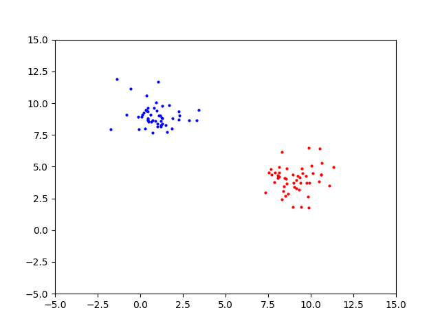
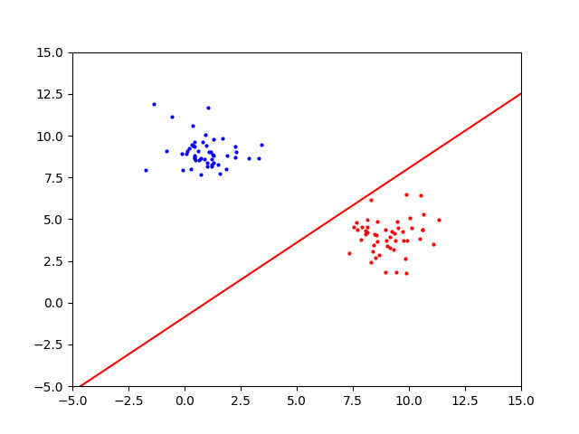
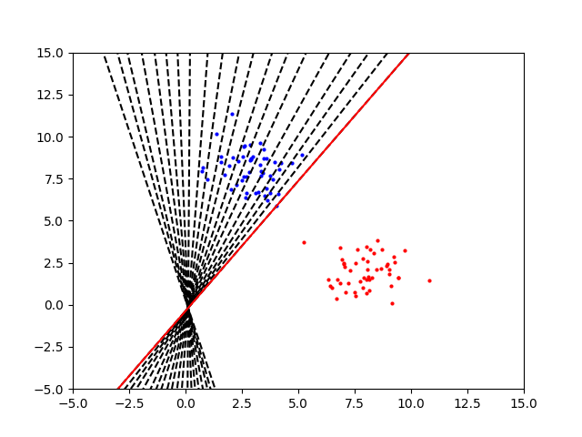
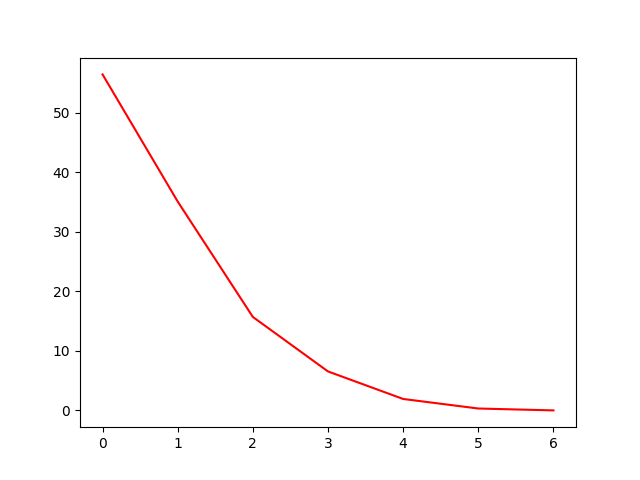
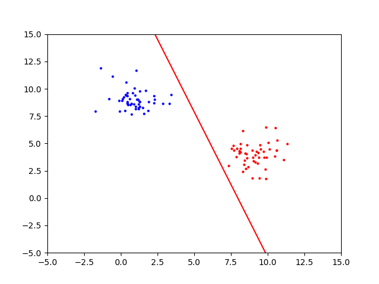
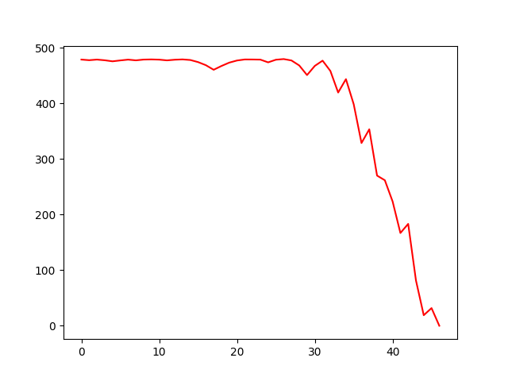
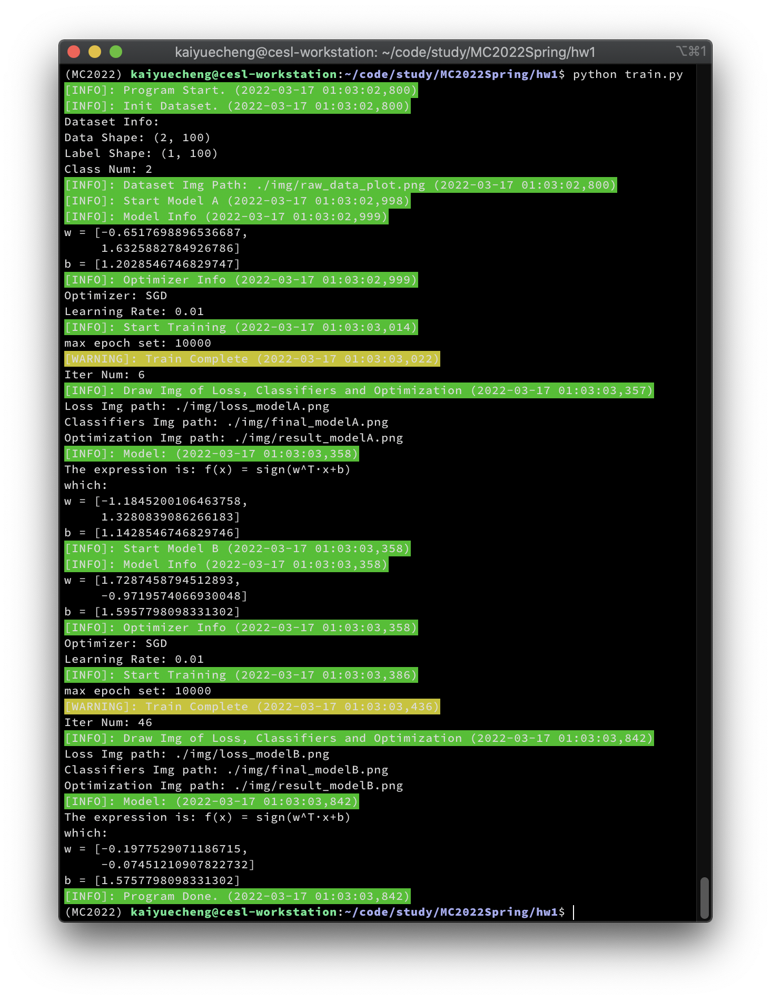

# MC2022Spring-Perceptron

Homework 1 of MC2022Spring(Media and Cognition 2022 Spring)

## Introduction

- A simple demo of a perceptron.

- The dataset is a set of linearizable samples, there are 50 positive and negative samples each.

- Optimization was performed using the stochastic gradient descent method.

## Requirements

```
colorlog==6.6.0
matplotlib==3.5.1
numpy==1.21.5
```

## Run Demo

1. Make sure you have the folder: `'./img/'`
2. Enjoy it!

```
python train.py
```

## Result

- Dataset

  

- Result of model A

  

- Optim process of model A

  

- Loss of model A

  

- Result of model B

  

- Optim process of model B

  

- Loss of model B

  

## Output in Terminal

